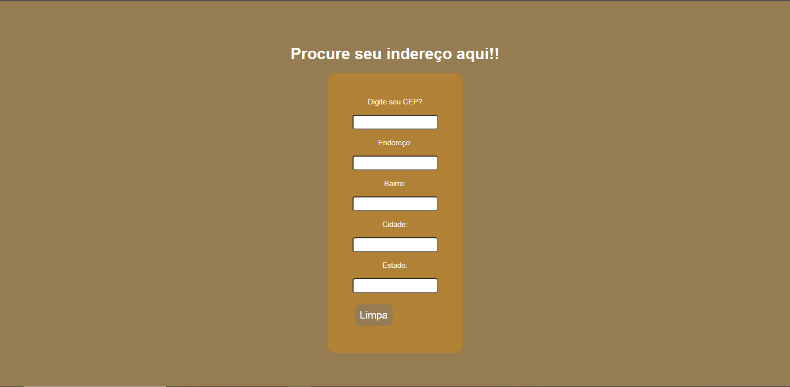

# ✔️ Busca CEP

## 💻 Sobre o projeto
Esse site faz busca do endereço de um CEP fornecido com o auxílio de um webservice gratuito da [ViaCep](https://viacep.com.br/)

## 🛠 Tecnologias utilizadas

* Javascript 
* HTML
* CSS

## 🎨 Layout
 

## 🦸 Autora

<a href="">

